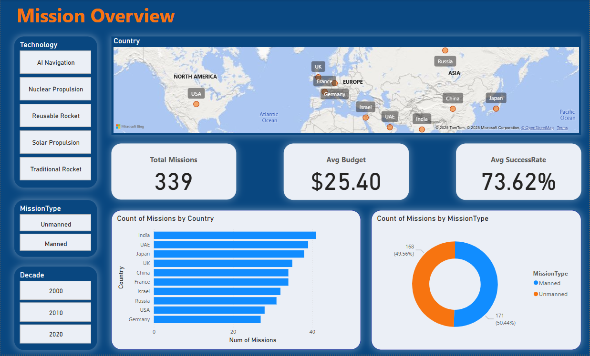
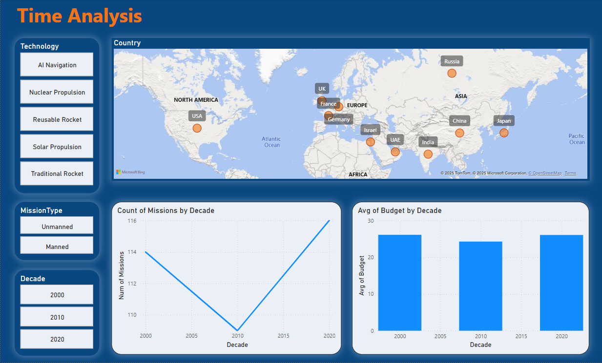

# 🌍 Global Space Exploration Project 🚀

This end-to-end data project explores global space missions through data engineering and business intelligence techniques. It includes **data modeling**, **ETL pipeline**, **SQL analytics**, and an **interactive Power BI dashboard** to uncover patterns and insights about global mission trends, technologies used, and collaborative efforts.

---

## 📁 Project Structure

| File / Folder                             | Description                                                    |
|-------------------------------------------|----------------------------------------------------------------|
| `globalspaceexplorationdataset.csv`       | Raw dataset containing information about global space missions |
| `eda.ipynb`                               | Jupyter notebook for data cleaning and exploratory analysis    |
| `globalspaceexploration-etl.ipynb`        | Python-based ETL pipeline to load and transform the data       |
| `create-dwschema.sql`                     | SQL script to create the data warehouse schema                 |
| `analytics-queries.sql`                   | SQL queries for data analysis and validation                   |
| `globalspaceexploration-dashboard.pbix`   | Power BI dashboard showcasing the final analytics              |
| `screenshots/`                            | Folder for storing dashboard screenshots                       |

---

## 🧠 Project Goals

- Design and build a **star schema**-based data warehouse  
- Build a **Python ETL pipeline** to transform and load data  
- Perform **analytical SQL queries** for key business insights  
- Create an **interactive Power BI dashboard** for stakeholders  

---

## 📊 Dashboard Pages

1. **Mission Overview**  
   - Total missions, average success rate, mission type by country  

2. **Time Analysis**  
   - Mission count by year/decade, budget trends  

3. **Technology & Satellite Type**  
   - Success rate by technology, duration by satellite type  

4. **Collaboration & Environmental Impact**  
   - Country collaborations, impact type distribution  

---

## 🔍 Key Insights

- ✅ Technology with the **highest average success rate**  
- 💰 Budget distribution **across decades and countries**  
- 🌎 Top-performing **countries by mission count and success**  
- 🌿 Analysis of **environmental impact** by mission type  
- 🤝 Patterns of **international collaboration**  

---

## 🛠 Tools & Technologies

- **Python** – Pandas, NumPy, Jupyter Notebooks  
- **SQL Server** – Data warehouse schema, analytics queries  
- **Power BI** – Interactive dashboard design
  
---

## 🖼️ Screenshots 

```


```
